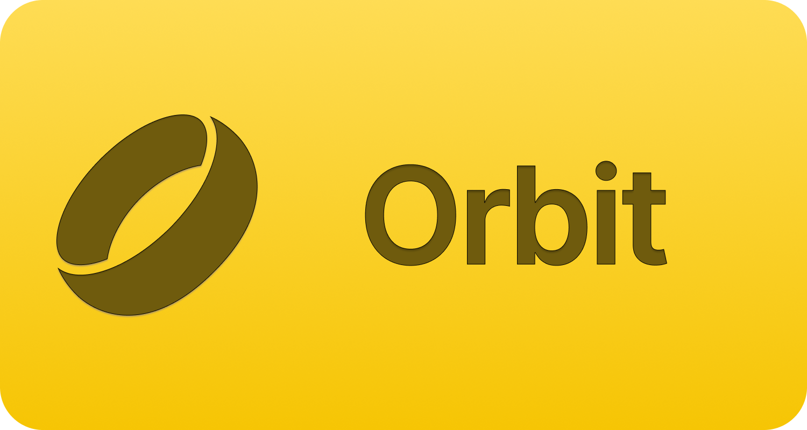

# Orbit

<picture>
  <source media="(prefers-color-scheme: dark)" srcset="./Assets/Orbit-dark.png">
  <source media="(prefers-color-scheme: light)" srcset="./Assets/Orbit-light.png">
  
</picture>

<p align="center">
  A Swift app for collecting and analizing Colmi Ring health data.
</p>

> [!IMPORTANT]
> This app is still under heavy development and testing. A TestFlight beta will be available soon.

> [!CAUTION]
> Always consult a medical professional if you believe something is wrong. Do not use data retrieved from wearables to make medical decisions on your own, and for God’s sake, don’t feed it into LLMs.

## Overview

Orbit is a personal project built with SwiftUI, focused on collecting and visualizing health metrics from **Colmi smart rings**. It is inspired by the article [Halo: Open Source Health Tracking with Wearables](https://huggingface.co/blog/cyrilzakka/halo-introduction) and the research conducted by @cyrilzakka and the [Gadgetbridge](https://codeberg.org/Freeyourgadget/Gadgetbridge) project.

## Current Scope

Orbit is currently focused on:

- Native pairing experience with **CoreBluetooth**
- Health data synchronization:
  - Heart Rate
  - Sleep
  - Activity (Steps, Calories, Distance)
  - SpO₂

- HealthKit integration
- Encrypted on-device storage

## Tech Stack

- **SwiftUI**
- **CoreBluetooth**
- **Lottie**
- Local storage (Core Data / SwiftData — update if applicable)
- iOS 17+

## Requirements

- Xcode 15+
- iOS 17+ device (Bluetooth required)
- Physical Colmi Ring (the simulator does not support Bluetooth)

## Installation

Clone the repository:

```bash
git clone https://github.com/Daniele-rolli/orbit.git
cd orbit
```

Open the project:

```bash
open Orbit.xcodeproj
```

Build and run on a physical device.

## Development Notes

- Expect unstable APIs.
- Bluetooth handling is still being refined.
- Data models may change.
- No backward compatibility guarantees yet.
- Orbit should be compatible with all Colmi rings. However, as I only own an R02, I cannot test all features.
- Compatibility with other brands or device types (e.g., smartwatches) is not currently planned.

If you're building on top of Orbit, expect to rebase frequently.

## Contributing

Contributions are welcome, but keep in mind:

- The architecture is still evolving.
- Large refactors may happen.
- Open an issue before starting major work.

### Guidelines

- Keep PRs focused and small.
- Follow Swift naming conventions.
- Prefer composition over inheritance.
- Avoid adding heavy dependencies.

## Roadmap

- [ ] Data export (CSV / JSON)
- [ ] Improved settings
  - Measurement units
  - Wearing preferences
  - HealthKit settings
- [ ] UI refinement
- [ ] Public beta
- [ ] Vitals
- [ ] Widgets
- [ ] Notifications
- [ ] Background sync

## Disclaimer

Orbit is an independent project and is not affiliated with Colmi.

Use at your own risk.
